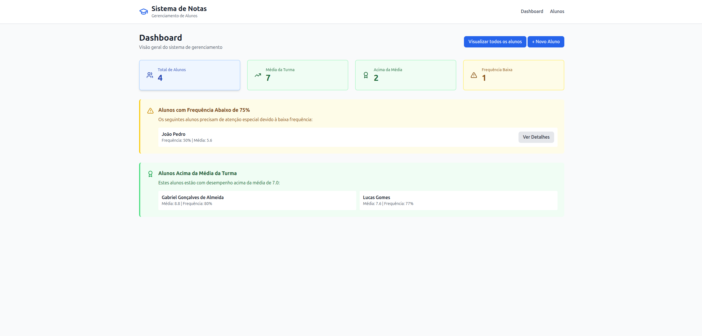
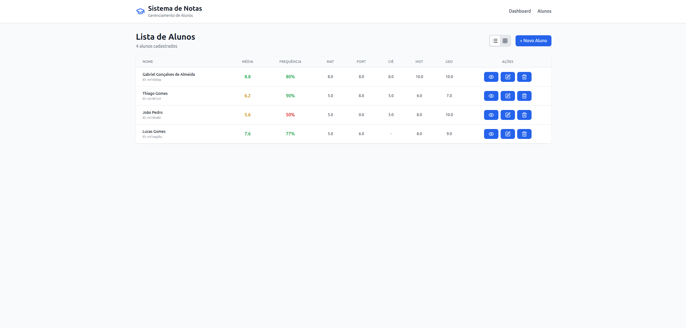
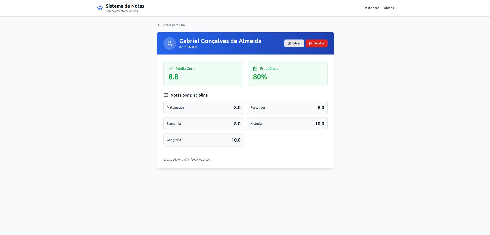
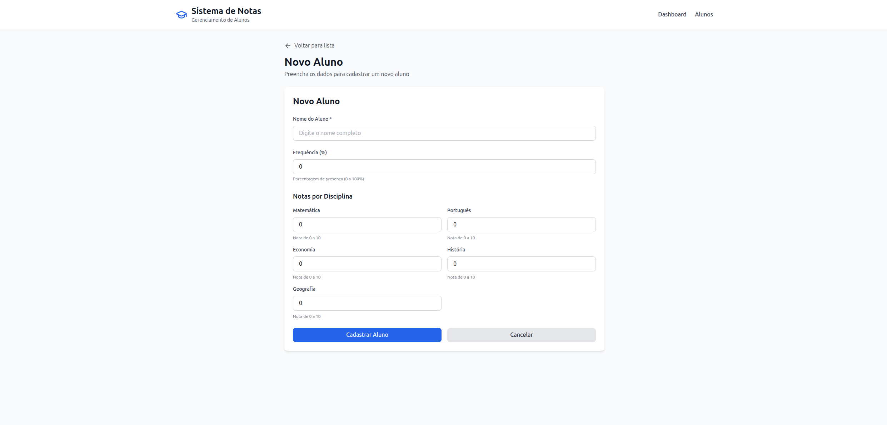
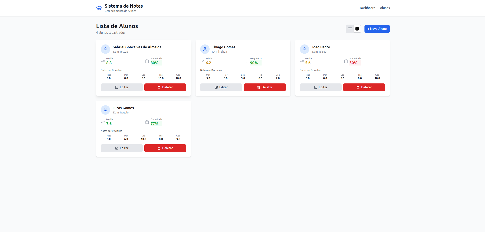

# Sistema de Gerenciamento de Notas e Frequência

Sistema desenvolvido para auxiliar professores no gerenciamento de notas e frequência de alunos, com cálculos automáticos de médias e identificação de alunos que necessitam atenção especial.


---

## Tecnologias Utilizadas

### Frontend Web
- React 18 com TypeScript
- Vite - Build tool
- React Router DOM - Navegação
- Tailwind CSS - Estilização
- Axios - Requisições HTTP
- Lucide React - Ícones

### Mobile
- React Native com Expo
- TypeScript
- React Navigation
- StyleSheet nativo
- Axios

### Backend
- Node.js com Express
- ES Modules
- CORS
- JSON File Storage

---

## Funcionalidades

### Gerenciamento de Alunos
- Cadastro, edição e exclusão
- Visualização detalhada individual
- Lista completa com filtros

### Gestão de Notas
- Registro em 5 disciplinas: Matemática, Português, Ciências, História e Geografia
- Validação: notas de 0 a 10

### Controle de Frequência
- Registro em percentual (0 a 100%)
- Alertas automáticos para frequência < 75%

### Cálculos Automáticos
- Média individual de cada aluno
- Média da turma por disciplina
- Média geral da turma
- Identificação de alunos acima da média
- Identificação de alunos com frequência baixa

### Interface
- Dashboard com estatísticas
- Visualização em tabela ou cards
- Design responsivo (web e mobile)
- Alertas visuais contextuais

---

## Instalação e Execução

### Pré-requisitos
- Node.js 18+
- npm
- Expo Go (para mobile)

### 1. Clone o repositório
```bash
git clone <url-do-repositorio>
cd DTI-DIGITAL
```

### 2. Backend
```bash
cd Backend
npm install
npm run dev
```
Servidor rodando em `http://localhost:3000`

### 3. Frontend Web
```bash
cd Frontend
npm install
npm run dev
```
Aplicação em `http://localhost:5173`

### 4. Mobile (opcional)
```bash
cd Mobile
npm install

# Configure o IP no arquivo src/services/api.ts
# Substitua SEU_IP pelo resultado de: ip addr show | grep inet

npx expo start
```
Escaneie o QR Code com Expo Go no celular.

---

## Estrutura do Projeto

### Backend
```
Backend/
├── src/
│   ├── controllers/    # Lógica das requisições
│   ├── routes/         # Definição de rotas
│   ├── models/         # Persistência (JSON)
│   ├── utils/          # Cálculos e helpers
│   └── server.js       # Entrada da aplicação
├── data/
│   └── students.json   # Gerado automaticamente
└── package.json
```

### Frontend Web
```
Frontend/
├── src/
│   ├── components/     # Componentes reutilizáveis
│   ├── pages/          # Páginas da aplicação
│   ├── services/       # Chamadas à API
│   ├── context/        # Estado global
│   ├── types/          # TypeScript types
│   └── App.tsx
└── package.json
```

### Mobile
```
Mobile/
├── src/
│   ├── screens/        # Telas do app
│   ├── components/     # Componentes reutilizáveis
│   ├── navigation/     # Configuração de rotas
│   ├── services/       # Chamadas à API
│   ├── context/        # Estado global
│   └── styles/         # Cores e espaçamentos
└── App.tsx
```

---

## API Endpoints

### Alunos
- `GET /api/students` - Lista todos
- `GET /api/students/:id` - Busca por ID
- `POST /api/students` - Cria novo
- `PUT /api/students/:id` - Atualiza
- `DELETE /api/students/:id` - Remove

### Notas e Frequência
- `PUT /api/grades/:id/grades` - Atualiza notas
- `PUT /api/grades/:id/attendance` - Atualiza frequência

### Relatórios
- `GET /api/students/reports/above-average` - Alunos acima da média
- `GET /api/students/reports/low-attendance` - Frequência < 75%

---

## Premissas Assumidas

### Regras de Negócio
1. **Notas**: Valores de 0 a 10, permitindo decimais
2. **Frequência**: Valores de 0 a 100 (percentual)
3. **Limite de atenção**: Alunos com < 75% de frequência
4. **Disciplinas**: 5 disciplinas fixas pré-definidas
5. **Média**: Calculada como média aritmética simples
6. **Alunos destaque**: Média estritamente maior que a média da turma

### Persistência
- Dados armazenados em arquivo JSON
- Arquivo criado automaticamente na primeira execução
- Ideal para desenvolvimento e testes
- Produção recomenda-se banco de dados real

### Validações
- Nome do aluno obrigatório
- Notas entre 0 e 10
- Frequência entre 0 e 100
- Disciplinas permitidas: apenas as 5 cadastradas

---

## Decisões de Projeto

### Arquitetura
- **Separação Frontend/Backend**: Permite escalabilidade e reuso da API
- **RESTful API**: Padrão de mercado, fácil manutenção
- **TypeScript**: Maior segurança de tipos e produtividade
- **Context API**: Gerenciamento de estado sem dependências extras

### Design Patterns
- **Component-Based**: Componentes reutilizáveis e modulares
- **Service Layer**: Lógica de API centralizada
- **Controller Pattern**: Separação clara de responsabilidades
- **Utility Functions**: Cálculos isolados para facilitar testes

### UX/UI
- **Responsivo**: Mobile-first, funciona em qualquer dispositivo
- **Feedbacks Visuais**: Loading, cores para status, alertas contextuais
- **Navegação Intuitiva**: URLs amigáveis, fluxo claro
- **Duas interfaces**: Web (Tailwind) e Mobile (StyleSheet)

### Performance
- **Cálculos no Backend**: Evita processamento no cliente
- **State Management**: Context API otimizado
- **JSON Storage**: Suficiente para escopo do projeto

---

## Possíveis Melhorias Futuras

- Autenticação de usuários
- Banco de dados (PostgreSQL/MongoDB)
- Gráficos de desempenho
- Exportação de relatórios (PDF/Excel)
- Testes automatizados
- Dark mode
- PWA

---

---

## Screenshots

### Frontend Web

#### Dashboard

*Visão geral com estatísticas e alertas*

#### Lista de Alunos

*Visualização em tabela com todas as informações*

#### Detalhes do Aluno

*Informações completas e notas por disciplina*

#### Formulário

*Cadastro/edição de aluno com validações*

### Cards

*Informações dos alunos em Cards
### Mobile


#### Dashboard Mobile


#### Lista Mobile


#### Detalhes Mobile


---
```

---

## Estrutura de pastas para imagens:
```
DTI-DIGITAL/
├── docs/
│   └── images/
│       ├── dashboard-web.png
│       ├── lista-alunos-web.png
│       ├── detalhes-aluno-web.png
│       ├── formulario-web.png
│       ├── dashboard-mobile.png
│       ├── lista-mobile.png
│       └── detalhes-mobile.png

## Troubleshooting

### Backend não inicia
```bash
cd Backend
rm -rf node_modules
npm install
npm run dev
```

### Frontend com erro de cache
```bash
cd Frontend
rm -rf node_modules/.vite
npm run dev
```

### Mobile não conecta
1. Verifique se backend está rodando
2. Confirme IP correto em `Mobile/src/services/api.ts`
3. Certifique-se que celular e PC estão na mesma rede Wi-Fi

---

## Autor

Desenvolvido para processo seletivo DTI Digital - Vaga de Estágio React

---

## Licença

Este projeto foi desenvolvido para fins educacionais e de avaliação técnica.
```

---

## Crie também o `.gitignore` na raiz:
```
node_modules/
dist/
.env
data/students.json
*.log
.expo/
.expo-shared/
